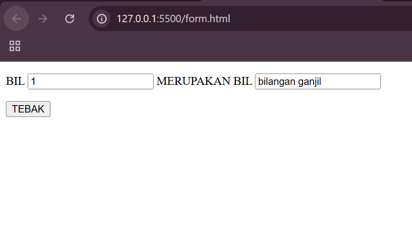
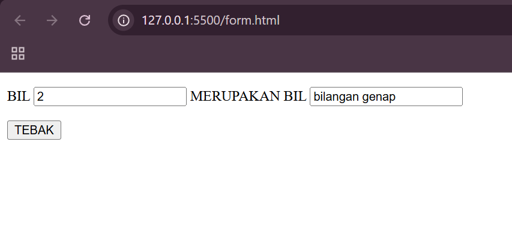
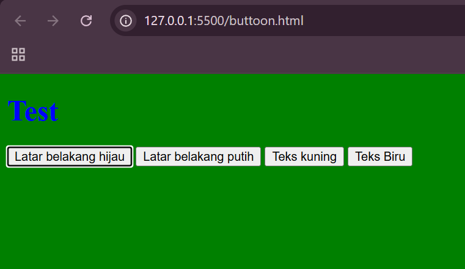
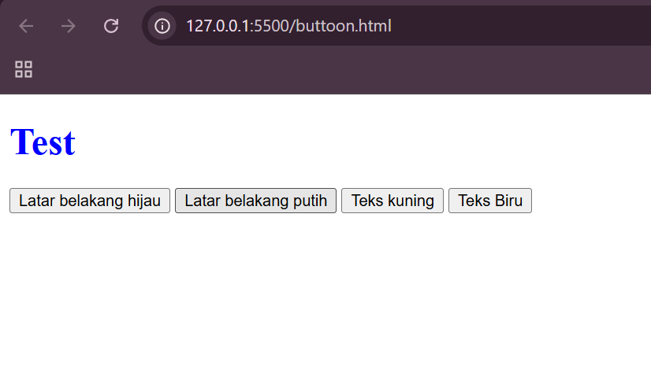
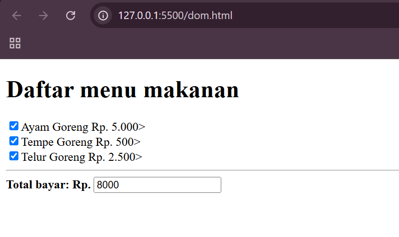
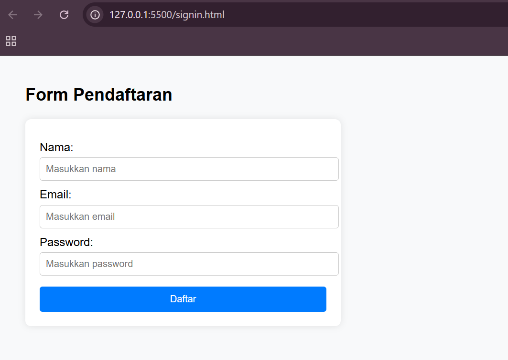

# lab5web
### Nama: M. Rizqy Al Rasyd
### Nim : 312410424
### Kelas : TI.24.A3

### FORM INPUT
Code:
``` <!DOCTYPE html>
<html lang="en">
<head>
    <meta charset="UTF-8">
    <meta name="viewport" content="width=device-width, initial-scale=1.0">
    <title>ganjil/genap</title>
    <script lang="javascript">
        function test () {
            var val1=document.kirim.T1.value
            if (val1%2==0)
                document.kirim.T2.value="bilangan genap"
            else
                document.kirim.T2.value="bilangan ganjil"
        }
    </script>
</head>
<body>
    <form method="POST" name="kirim">
        <p>BIL <input type="text" name="T1" size="20">
        MERUPAKAN BIL <input type="text" name="T2" size="20"></p>
        <p><input type="button" value="TEBAK" name="B1" onclick="test()"></p>
    </form>
    
</body>
</html>
```

Hasil:
Jika bilangan ganjil:

Jika bilangan genap:


### FORM BUTTON
Code:
``` <!DOCTYPE html>
<html lang="en">
<head>
    <title>Objek document</title>
</head>
<body>
    <script language = "javascript">
        function ubahWarnaLB(warna) {
            document.bgColor = warna;
        }
        function ubahWarnaLD(warna) {
            document.fgColor = warna;
        }
    </script>
    <h1>Test</h1>
    <form>
        <input type="button" value="Latar belakang hijau" onclick="ubahWarnaLB('Green')">
        <input type="button" value="Latar belakang putih" onclick="ubahWarnaLB('White')">
        <input type="button" value="Teks kuning" onclick="ubahWarnaLD('Yellow')">
        <input type="button" value="Teks Biru" onclick="ubahWarnaLD('Blue')">
    </form>
    <script language="javascript>
     <!--
        document.write("Dimodifikasi terakhir pada" +
        document.lastmodified);
    //-->   
    </script>
</body>
</html>
```

Hasil:
Latar belakang hijau:

Teks biru:



### CHECKBOX
Code:
``` <!DOCTYPE html>
<html lang="en">
<head>
    <meta charset="UTF-8">
    <meta name="viewport" content="width=device-width, initial-scale=1.0">
    <title>Daftar Menu</title>
    <script>
        function hitung(ele) {
            var total = document.getElementById('total'). value;
                total = (total ? parseInt(total) :0);
            var harga = 0;

            if (ele.checked) {
                harga = ele.value;
                total += parseInt(harga);
            } else {
                harga = ele.value;
                if (total > 0)
                    total -= parseInt(harga);
            }
            document.getElementById('total').value = total;
        }
    </script>
</head>
<body>
    <h1>Daftar menu makanan</h1>
    <label><input type="checkbox" value="5000" id="menu" onclick="hitung(this);" />Ayam Goreng Rp. 5.000></label><br>
    <label><input type="checkbox" value="500" id="menu2" onclick="hitung(this);" />Tempe Goreng Rp. 500></label><br>
    <label><input type="checkbox" value="2500" id="menu3" onclick="hitung(this);" />Telur Goreng Rp. 2.500></label><hr>
    <strong>Total bayar: Rp. <input id="total" type="text" /></strong>
</body>
</html>
```

Hasil:



### FORM VALIDASI
Code:
``` <!DOCTYPE html>
<html lang="id">
<head>
  <meta charset="UTF-8">
  <meta name="viewport" content="width=device-width, initial-scale=1.0">
  <title>Form Validasi</title>
  <style>
    body {
      font-family: Arial, sans-serif;
      margin: 40px;
      background-color: #f8f9fa;
    }
    form {
      background: white;
      padding: 20px;
      border-radius: 8px;
      box-shadow: 0 0 10px rgba(0,0,0,0.1);
      max-width: 400px;
    }
    label {
      display: block;
      margin-top: 10px;
    }
    input {
      width: 100%;
      padding: 8px;
      margin-top: 5px;
      border: 1px solid #ccc;
      border-radius: 4px;
    }
    .error {
      color: red;
      font-size: 0.9em;
    }
    button {
      margin-top: 15px;
      padding: 10px;
      width: 100%;
      background-color: #007bff;
      color: white;
      border: none;
      border-radius: 4px;
      cursor: pointer;
    }
    button:hover {
      background-color: #0056b3;
    }
  </style>
</head>
<body>
  <h2>Form Pendaftaran</h2>

  <form id="registerForm">
    <label for="name">Nama:</label>
    <input type="text" id="name" placeholder="Masukkan nama">
    <div class="error" id="nameError"></div>

    <label for="email">Email:</label>
    <input type="email" id="email" placeholder="Masukkan email">
    <div class="error" id="emailError"></div>

    <label for="password">Password:</label>
    <input type="password" id="password" placeholder="Masukkan password">
    <div class="error" id="passwordError"></div>

    <button type="submit">Daftar</button>
  </form>

  <script>
    const form = document.getElementById("registerForm");

    form.addEventListener("submit", function(event) {
      event.preventDefault();

      const name = document.getElementById("name").value.trim();
      const email = document.getElementById("email").value.trim();
      const password = document.getElementById("password").value.trim();

      const nameError = document.getElementById("nameError");
      const emailError = document.getElementById("emailError");
      const passwordError = document.getElementById("passwordError");

      nameError.textContent = "";
      emailError.textContent = "";
      passwordError.textContent = "";

      let isValid = true;

      if (name === "") {
        nameError.textContent = "Nama tidak boleh kosong";
        isValid = false;
      }

      const emailPattern = /^[^ ]+@[^ ]+.[a-z]{2,3}$/;
      if (email === "") {
        emailError.textContent = "Email tidak boleh kosong";
        isValid = false;
      } else if (!email.match(emailPattern)) {
        emailError.textContent = "Format email tidak valid";
        isValid = false;
      }

      if (password.length < 6) {
        passwordError.textContent = "Password minimal 6 karakter";
        isValid = false;
      }

      if (isValid) {
        alert("Pendaftaran berhasil!");
        form.reset();
      }
    });
  </script>
</body>
</html>
```

Hasil:


